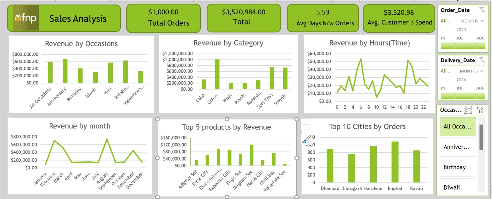

# 📊 Sales Analysis Dashboard – Excel

An interactive **Sales Analysis Dashboard built using Microsoft Excel** to analyze sales performance, customer behavior, product performance, delivery efficiency, and geographical order trends.

The project uses **Power Query, Power Pivot, DAX, PivotTables, PivotCharts, and Interactive Slicers** to transform raw sales data into a business-ready analytical dashboard.

---

## 📸 Dashboard Preview



> The dashboard provides an interactive view of sales performance across occasions, categories, hours, months, products, and cities.

---

## 🎯 Project Objective

The main objective of this project is to analyze sales data and answer important business questions such as:

- What is the total revenue generated?
- How many orders were placed?
- What is the average time between order and delivery?
- How much does the average customer spend?
- Which occasions generate the highest revenue?
- Which product categories generate the most revenue?
- Which products are the top revenue contributors?
- Which cities have the highest number of orders?
- During which hours are sales highest?
- Which months generate the highest revenue?
- How does delivery performance vary across orders?

---

# 📌 Key Performance Indicators (KPIs)

The dashboard tracks important business KPIs including:

| KPI | Description |
|---|---|
| 💰 Total Revenue | Total revenue generated from all orders |
| 🛒 Total Orders | Total number of orders placed |
| 🚚 Avg. Days Between Orders | Average difference between order and delivery dates |
| 👤 Avg. Customer Spend | Average revenue generated per customer |

### Current Dashboard KPIs

- **Total Revenue:** ₹3,520,984
- **Average Days Between Orders:** 5.53 days
- **Average Customer Spend:** ₹3,520.98
- **Total Orders:** Calculated dynamically from the dataset

---

# 📊 Dashboard Analysis

## 1. Revenue by Occasion

Analyzes revenue generated across different occasions such as:

- Anniversary
- Birthday
- Diwali
- Holi
- Raksha Bandhan
- Valentine's Day

This helps identify which occasions contribute the most to overall revenue.

---

## 2. Revenue by Category

The dashboard analyzes revenue across different product categories, including:

- Cake
- Colors
- Mugs
- Plants
- Raksha Bandhan products
- Soft Toys
- Sweets

This analysis helps identify high-performing product categories.

---

## 3. Revenue by Hour

The dashboard analyzes revenue across different hours of the day.

This can help identify:

- Peak sales hours
- Low-performing hours
- Customer purchasing patterns
- Potential opportunities for marketing campaigns

---

## 4. Revenue by Month

Monthly revenue trends are visualized to identify:

- High-revenue months
- Low-revenue months
- Seasonal trends
- Revenue fluctuations

This can help businesses plan inventory and marketing activities.

---

## 5. Top Products by Revenue

The dashboard identifies the highest revenue-generating products.

This analysis can be used to:

- Identify best-selling products
- Optimize inventory
- Prioritize high-performing products
- Plan promotional campaigns

---

## 6. Top Cities by Orders

The dashboard analyzes the number of orders received from different cities.

This helps identify:

- High-demand cities
- Potential expansion markets
- Regional customer behavior
- Areas requiring stronger marketing

---

# 🔎 Interactive Filters

The dashboard contains interactive slicers that allow users to dynamically filter the analysis.

### Available Filters

- 📅 Order Date
- 🚚 Delivery Date
- 🎉 Occasion

When a slicer is changed, the dashboard charts and KPIs update automatically.

---

# 🛠️ Tools & Technologies

### Microsoft Excel

The project was developed using advanced Excel features:

- Excel Tables
- Power Query
- Power Pivot
- DAX
- PivotTables
- PivotCharts
- Slicers
- GETPIVOTDATA
- Excel formulas

---

# 🔄 Data Preparation using Power Query

Power Query was used for data preparation and transformation.

### Main Data Cleaning Tasks

- Imported raw datasets
- Promoted headers
- Changed data types
- Converted date columns
- Converted time columns
- Handled date-format inconsistencies
- Created calculated columns
- Calculated delivery duration
- Prepared data for analysis
- Loaded cleaned data into Excel/Data Model

---

# 🧮 Power Pivot & DAX

Power Pivot was used to create analytical measures and work with the Data Model.

### Example DAX Measure

```DAX
Total Revenue = SUM([Revenue])
